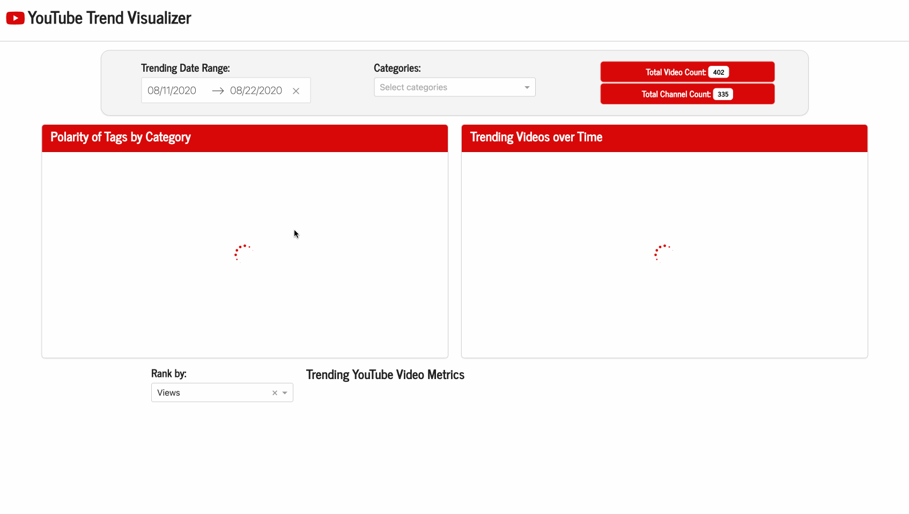

# 📺 YouTube Trend Visualizer



Contributors: Lauren Zung

Live Server: https://youtube-trend-visualizer.onrender.com/

## Proposal

Click [here](https://github.com/UBC-MDS/trending_youtube_viz_R/blob/main/reports/proposal.md) to read the initial motivation and purpose for this dashboard.

## Dashboard Features

This dashboard contains a single landing page that allows users to easily visualize YouTube video metrics. There is a calendar widget that can be configured to focus on trending videos between a date range. If desired, users can apply an additional filter using the dropdown category menu, which can be parsed by selecting and/or searching for topics of interest. These filters will update the settings for each plot and table, allowing for improved visibility and interpretation of trends over time. Aggregate counts of the number of videos and channels are also displayed to provide a comprehensive overview on the amount of data points displayed.

### 😀 Polarity Score Chart 😩

The polarity score of a video's taglist can be computed using the [Natural Language Toolkit sentiment analysis](https://www.nltk.org/howto/sentiment.html) library. This package contains a pre-trained model called **VADER** (Valence Aware Dictionary for Sentiment Reasoning) which can be leveraged to assign proportional polarity scores for positive, neutral and negative sentiment in text, as well as a compound score that is normalized between -1 and 1.

The bar plot displays this compound score as an average for each category of videos. Hovering over each bar shows the number of videos that comprise each category. Categories with tag lists that are considered more "positive" are closer to green, whereas categories with "negative" sentiment will appear more red (neutral is yellow).

### 📈 Category Trend Chart 📉

Users may be interested in seeing how many videos were trending over time in each category. A dotted line chart displays these fluctuations by date within a specified ranged (with the ability to mouse over points for summaries) to better examine trends in cases where lines may be overlapping or unclear.

### 👍 Video Metrics Table 👎

To parse details on the data included in the above charts, users may reference the metrics table for the title, channel name and category for each trending video. It features sorting and filtering options to allow you to search for specific channels, titles and categories or individual words like 'BTS' or 'VEVO'. The ranking widget assigns a rank according to the number of likes, dislikes, comments or views that a video received relative to others in the filtered data, thus allowing users to see these positions while ordering by another metric if desired (ex. rank by view, order by dislikes).

## Usage

To run this dashboard locally and/or use your own data collected from the YouTube API, clone this repository and download the environment found [here](https://github.com/lzung/youtube_trends/blob/main/environment.yaml) to install the necessary [dependencies](#dependencies).

1. Clone the repository

```bash
git clone https://github.com/lzung/youtube_trends.git
```

2. Navigate to the repository

```bash
cd youtube_trends
```

3. Create the environment

```bash
conda env create -f environment.yaml
```

Assuming that the environment was created successfully, you can activate the environment as follows:

```bash
conda activate youtube_trends
```

4. Navigate to the `src` folder and run `app.py` to render the dashboard.  You can view the app locally by opening a browser on port 8050 (`http://127.0.0.1:8050/`).

```bash
cd src
python app.py
```

If you want to add your own dataset, first import your data (as a `.csv`), then run the `feature_engineering.py` script with the appropriate file path to export.

## Dependencies

The associated environment with all dependencies required for this project can be found [here](https://github.com/lzung/youtube_trends/blob/main/environment.yaml).
- python==3.11.*
- ipykernel
- vega_datasets
- altair
- dash=2.8.*
- dash-bootstrap-components
- nltk
- pip:
    - dash-iconify
    - dash-mantine-components

## Live Dashboard

The dashboard is deployed on Render. You can view and interact with the app by [clicking here](https://youtube-trend-visualizer.onrender.com/).

## License

`youtube_trends` was created by Lauren Zung. It is licensed under the terms of the MIT license.

## References

Youtube. (2023). YouTube Trending Video Dataset (updated daily) [Data set]. Kaggle. https://doi.org/10.34740/KAGGLE/DSV/5003820

Note: As I'm based in Canada, I am using data extracted from videos that were trending in Canada due to file size limitations and for ease of loading/extraction. However, given the flexibility of this web app, it can be easily extended to YouTube data from other countries.
